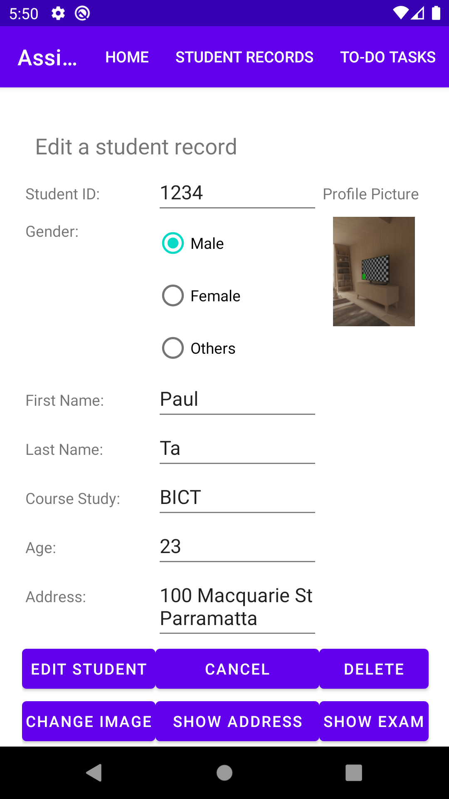
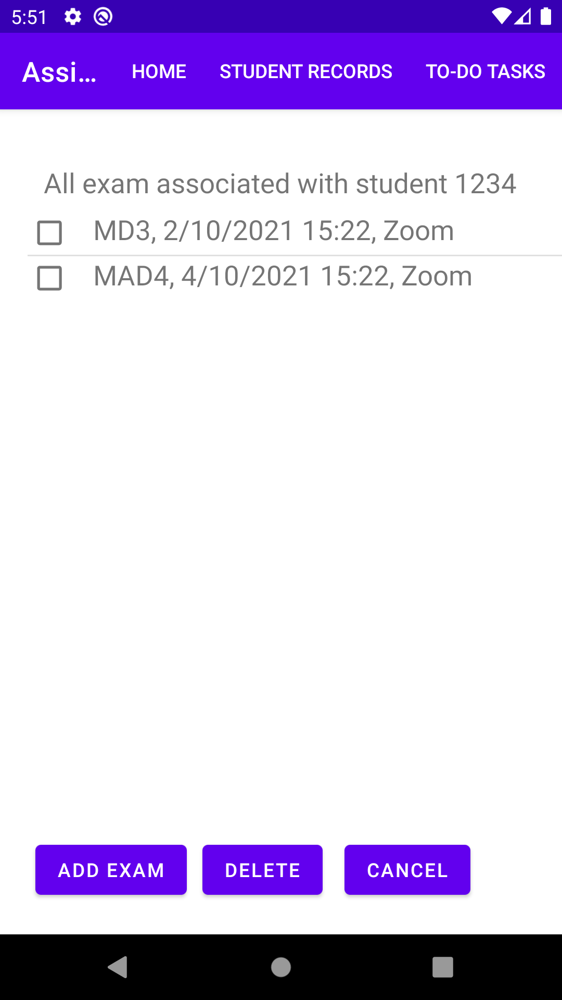
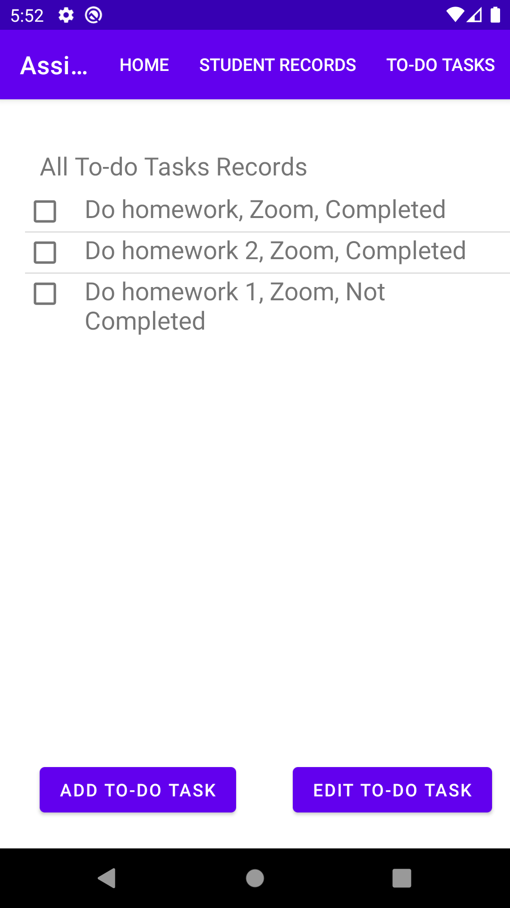
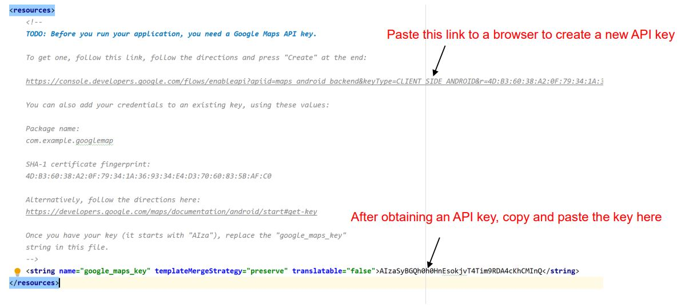

# Student Management Android App

A simple Student Management on an Android App

## Table of Contents
1. [About the projects](#about-the-project)
2. [Technologies](#technologies)
3. [Features](#features)
4. [Setup](#setup)
5. [Contributing](#contributing)

## About the project
This project is a WSU Assignment that aims to build a Student Management on an Android App. Aside from the home screen, the App has four main functions allowing users to view and manipulate student records, to-do task, and exams associated with each student.

## Technologies
* Java
* XML
* SQLite
* Google API 

## Features
#### Student records
* Add a new student record
* Edit and delete a selected student record
* Assign one or more photo(s) from the camera photo gallery to a selected student record
* Show a student address included in the record on Google map

#### Exams
* Add a new exam to the list
* View all the exam records associated with a student
* Delete multiple exams at the same time

#### To-do tasks
* Add a new to-do task
* View all to-do tasks
* Update a selected to-do task

## Setup
#### Prerequisites
* Android Studio
* Google API Key: follow to instruction below to obtain your key

#### Installation
* Open Android Studio
* Select File > New > Project from Version Control
* Enter the link https://github.com/longta119/StudentManagement-AndroidApp in the URL

## Contributing

Contributions are what make the open source community such an amazing place to learn, inspire, and create. Any contributions you make are **greatly appreciated**.

If you have a suggestion that would make this better, please fork the repo and create a pull request. You can also simply open an issue with the tag "enhancement".
Don't forget to give the project a star! Thanks again!

1. Fork the Project
2. Create your Feature Branch (`git checkout -b feature/AmazingFeature`)
3. Commit your Changes (`git commit -m 'Add some AmazingFeature'`)
4. Push to the Branch (`git push origin feature/AmazingFeature`)
5. Open a Pull Request
